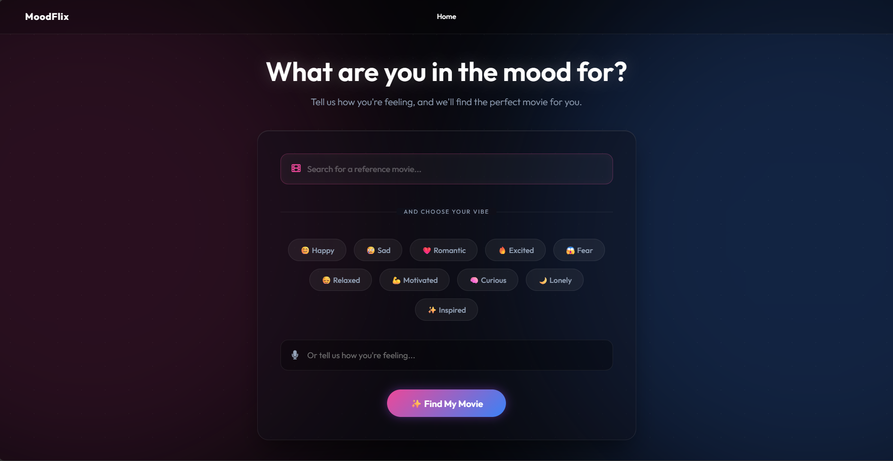
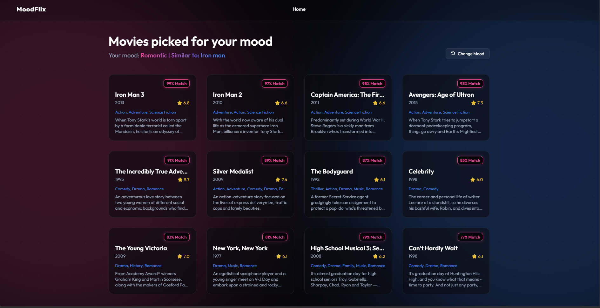

# 1. Project Title

**MoodFlix - Emotion-Aware Movie Recommendation System**

---

# 2. Project Overview

MoodFlix is an AI-powered movie recommendation platform that helps you discover movies based on your interests and current mood. Search for a movie, select how you're feeling, and let our intelligent recommendation engine find personalized movies for your next watch. 

Search. Discover. Feel. Watch.

---

# 3. Problem Statement

Traditional recommendation systems rely strictly on watch history, broad genres, or popularity metrics. However, they completely ignore the most crucial factor in deciding what to watch: the user's current emotional state. Users often spend more time scrolling through endless catalogs trying to find a movie that matches their specific vibe or feeling than actually watching the film.

---

# 4. Objectives

- To build a recommendation engine that understands and incorporates user emotions into its suggestions.
- To combine natural language mood inputs with traditional content-based filtering.
- To provide a seamless, Netflix-inspired user interface for an optimal user experience.
- To deliver highly personalized, explainable recommendations quickly and accurately.

---

# 5. Key Features

- **Voice input:** Use your microphone to describe your mood naturally.
- **Dynamic YouTube Trailers:** Automatically fetches and plays the exact movie trailer instantly.
- **Extended Recommendations:** Provides 12 highly relevant movie recommendations per search.
- **Emotion-based recommendations:** Get movies tailored to your current mood.
- **Hybrid recommendation engine:** Combines content-based filtering with mood-based preferences.
- **Explainable recommendations:** Understand exactly why each movie was recommended to you.
- **User favorites:** Save and manage your favorite movies.
- **Movie details:** Access comprehensive movie information seamlessly (ratings, release year, overviews).
- **Netflix-inspired UI:** Modern, highly responsive, aesthetic design.

---

# 6. How the Recommendation System Works

MoodFlix uses a **hybrid recommendation approach**:

1. **Content-Based Filtering (70% weight):**
   - Analyzes movie features: genres, keywords, cast, crew, and plot overview.
   - Uses TF-IDF vectorization and cosine similarity.
   - Finds movies most structurally and narratively similar to the user's selected base movie.

2. **Mood-Based Filtering (30% weight):**
   - Maps user emotions to specific genre preferences (e.g., "Happy" mood → Comedy, Family, Adventure).
   - Scores movies based on their mood-genre overlap.
   
3. **Hybrid Score Computation:**
   - The final suggestions are generated by combining the structural similarity score with the emotional resonance score.

---

# 7. Technology Stack

- **Backend:** Python, Flask
- **Frontend:** HTML5, CSS3, Vanilla JavaScript
- **Data Processing:** Pandas, NumPy
- **Machine Learning:** Scikit-learn, CountVectorizer, Cosine Similarity
- **Text Processing:** NLTK (Stemming)
- **APIs:** Speech Recognition API (Web), TMDB API (Optional fallback)

---

# 8. Project Architecture

The project follows a standard Client-Server architecture:
- **Client:** A responsive web application that captures user inputs (text and voice) and renders dynamic movie cards.
- **Server:** A Flask backend that handles routing, processes requests, and lazily loads Machine Learning models into memory.
- **Engine:** The core `recommender.py` module which computes the mathematical similarity between vector matrices.
- **Storage:** Pre-trained model artifacts (`movies.pkl`, `similarity.pkl`) are serialized and stored locally to ensure fast inference times.

---

# 9. Dataset

This project utilizes the **TMDB 5000 Movies Dataset** (The Movie Database).
- **tmdb_5000_movies.csv:** Contains metadata like budget, genres, homepage, original language, overview, popularity, release date, revenue, runtime, status, tagline, title, vote average, and vote count.
- **tmdb_5000_credits.csv:** Contains cast and crew information for the movies.

---

# 10. Installation

### Prerequisites
- Python 3.8+
- Git

### Setup Steps
1. **Clone the repository:**
   ```bash
   git clone https://github.com/Parth32007/MoodFlix.git
   cd MoodFlix
   ```
2. **Create a virtual environment:**
   ```bash
   python -m venv venv
   # Windows: venv\Scripts\activate
   # Mac/Linux: source venv/bin/activate
   ```
3. **Install dependencies:**
   ```bash
   pip install -r requirements.txt
   ```
4. **Prepare Data & Train Models:**
   ```bash
   python -m src.preprocessing
   ```

---

# 11. Usage

1. **Start the Flask server:**
   ```bash
   python app.py
   ```
2. Open your web browser and navigate to: `http://localhost:5000`
3. Enter a movie you like in the search bar.
4. Type in your current mood or use the microphone icon to speak it.
5. Click **Search** and explore your personalized recommendations!

---

# 12. Screenshots

- 
- 

---

# 13. Project Workflow

1. **Data Preprocessing:** Raw CSV data is cleaned, missing values are dropped, and JSON-like strings are parsed.
2. **Feature Engineering:** Genres, keywords, cast, crew, and plot overviews are combined into a single "tags" string.
3. **Vectorization:** Tags are stemmed using NLTK and converted into a matrix of token counts using `CountVectorizer`.
4. **Similarity Matrix:** Cosine similarity is computed for all 5000 movies.
5. **Web Interaction:** The user inputs a movie and a mood on the frontend.
6. **Inference:** The backend computes the hybrid score, fetches metadata for the top 12 matches, scrapes trailer links, and returns a JSON payload to the UI.

---

# 14. Future Improvements

- **Deep Learning Models:** Implement Collaborative Filtering or neural networks to replace basic CountVectorizer.
- **User Authentication:** Allow users to create accounts to save their watch history and favorites permanently.
- **Live TMDB Integration:** Fully migrate away from the static 5000 movie CSV and dynamically fetch the latest movies using the TMDB API.
- **Direct Streaming Links:** Provide immediate links to Netflix, Hulu, Prime Video, etc., where the movie is currently available.

---

# 15. Limitations

- **Static Dataset:** The recommendations are currently limited to the 5000 movies present in the dataset. Newer movies released after the dataset was compiled are not included.
- **Basic NLP:** The use of simple stemming and CountVectorizer might miss deeper semantic meanings and nuances in complex plot overviews.
- **Cold Start Problem:** If a user searches for an obscure movie not in the dataset, the system cannot provide content-based filtering.

---

# 16. Contributors

- [**Parth32007**](https://github.com/Parth32007) - *Lead Developer*
